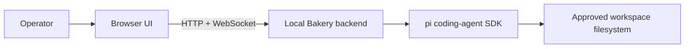
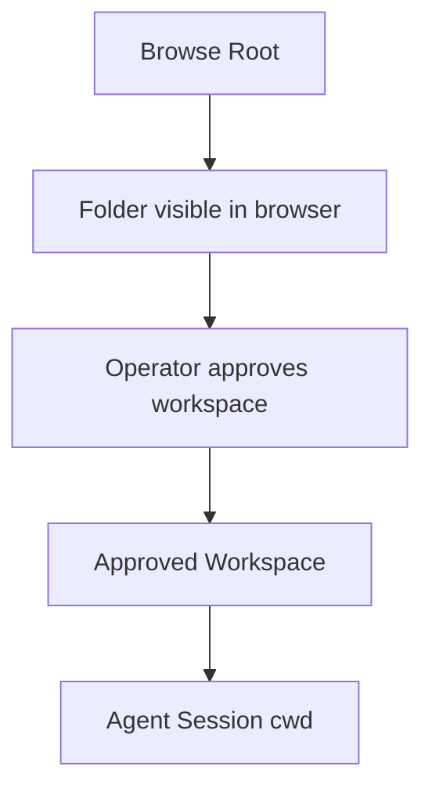
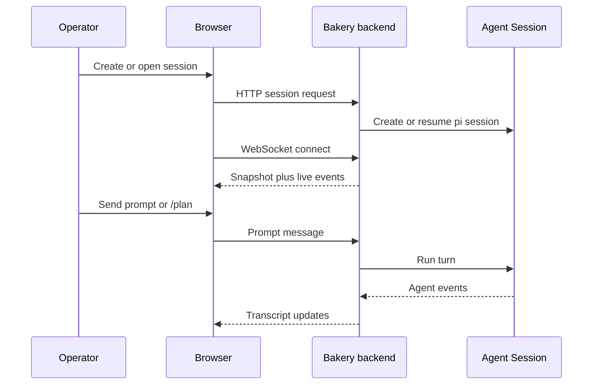

# Operating Bakery safely

This guide explains the day-to-day model for running Bakery after the [first-run quickstart](quickstart.md). It focuses on operator behavior: workspaces, sessions, auth boundaries, and normal runtime flow.

## Local runtime model

Bakery is a local-first browser UI backed by a local server process. The browser does not run the coding agent directly; it talks to the Bakery backend, which embeds the pi coding-agent SDK and runs sessions against approved filesystem workspaces.

The important consequence is that the backend process has the filesystem and credential access. Treat any workspace you expose to Bakery as a place where an agent can inspect files, edit files, and run commands.

## Workspace boundaries

Bakery uses a few related terms for filesystem access:

- **Workspace** — the directory an Agent Session runs in.
- **Browse Root** — a configured directory Bakery may show while browsing for workspaces.
- **Approved Workspace** — a directory the operator has explicitly trusted and added.
- **Agent Session cwd** — the concrete directory used by one server-backed pi session.

Keep Browse Roots and Approved Workspaces as narrow as practical. A project checkout is a better first boundary than a whole home directory. Revoking an Approved Workspace removes the runtime permission for future operations when no other root covers that path; it does not delete existing session records.

## Session model

An **Agent Session** is a server-backed pi coding-agent conversation bound to a workspace. It is not a browser tab. Multiple tabs can observe or reconnect to the same session.

Current operational expectations:

- One connected browser client acts as controller; viewer tabs can take control when needed.
- Reconnect is snapshot-based: reopening a session gives the current persisted state plus live events.
- In-flight agent turns are not recovered after a backend restart in the first version.
- Session titles and summaries are Bakery metadata; explicit generation or manual edits should not surprise-spend tokens in the background.

## Normal prompting workflow

Common ways to interact with a session:

- **Prompt** — normal coding-agent instruction.
- **Ask mode** — guided question style intended to discourage edits and shell commands unless requested.
- **`/plan`** — recommended when you want Bakery to inspect context, interview you one question at a time, and produce a Plan Card before implementation.
- **Bash modes** — `!` and `!!` run shell commands through the session path; use them deliberately because they execute in the workspace context.
- **Image attachments** — paste, drag, or pick supported images; Bakery stores prompt attachments/artifacts locally and sends image bytes to the agent path.

Use `/plan` for uncertain work. Use a direct prompt for a small, well-understood edit. Use Ask mode when you want explanation or review without inviting implementation.

## Localhost, LAN, and tokens

The safe default is local-only:

- `PI_WEB_HOST=127.0.0.1` binds the backend to localhost.
- Localhost access can run without an auth token in development.
- Non-localhost access should be explicit and token-protected with `PI_WEB_AUTH_TOKEN`.

Use [local network access](local-network.md) when opening Bakery from a phone, tablet, another laptop, or a Tailscale hostname. Keep the workspace root narrow before exposing the UI beyond localhost.

## Container mode

Containerized development is an alternative, not the default quickstart. Use it when you are developing Bakery itself in Docker, want container-owned dependency/runtime behavior, or need trusted-dev opt-ins such as SSH-agent or GitHub CLI forwarding inside the container.

See [containerized development](container-development.md) for Docker Compose setup, mounted paths, auth options, and validation expectations.

## Optional advanced features

Some Bakery features are useful after the basic model is clear:

- **Isolated worktree sessions** keep agent edits in a managed Git worktree instead of the source checkout.
- **Preview Stack** starts a review environment for an isolated session on temporary local ports.
- **Event Fork** creates a new session from a selected transcript event; the first behavior forks conversation history, not workspace file state.
- **Session Metadata Generation** explicitly proposes titles/summaries from the transcript.

Treat these as optional workflow tools. They do not replace the basic workspace trust boundary: the backend still operates on the filesystem available to the session.

## Stop and restart

- `bun run bakery` runs the current launcher prototype in the foreground; press `Ctrl+C` to stop its backend and Vite child processes.
- Contributors using `bun run dev` can restart only the backend with `bun run dev:server:restart` while keeping the browser/Vite state.
- If a backend restart happens during an active turn, expect to reopen/resume from persisted session state rather than recovering the in-flight work.

For ports, logs, and recovery commands, continue to the troubleshooting guide once added.
