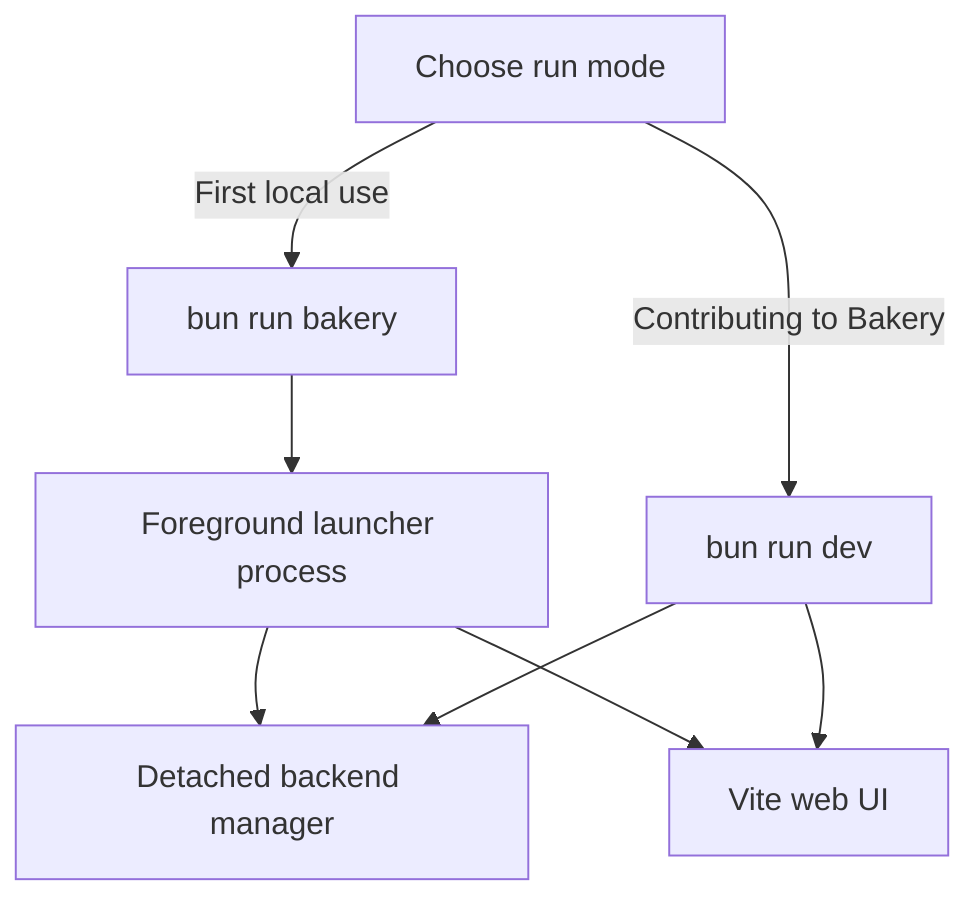
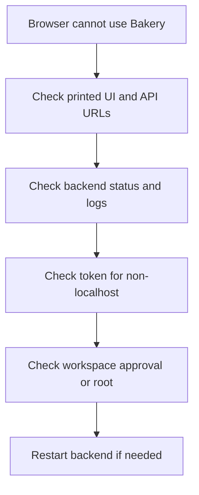

# Troubleshooting and developer operation

Use this guide when Bakery does not start, the browser cannot connect, auth/workspace checks fail, or you need to operate the contributor dev-server stack. Start with the [quickstart](quickstart.md) and [operation guide](operation.md) if you have not run Bakery successfully yet.

## Command map

| Task | Command |
| --- | --- |
| Check local readiness | `bun run doctor` |
| Start the foreground launcher prototype | `bun run bakery` |
| Start contributor backend manager plus Vite | `bun run dev` |
| Check managed backend status | `bun run dev:server:status` |
| Restart only the backend | `bun run dev:server:restart` |
| Show backend logs | `bun run dev:server:logs` |
| Stop the managed backend | `bun run dev:server:down` |
| Run static/project checks | `bun run check` |
| Choose focused validation for changed files | `bun run report:iteration --recommend <changed files>` |
| Open a headed fake-agent browser for exploration | `bun run ui:manual` |

## Launcher vs contributor dev loop

Use `bun run bakery` for the source-checkout version of the operator-facing launcher. Use `bun run dev` when contributing to Bakery and you want the managed backend plus Vite development loop.



The launcher stops its child processes when you press `Ctrl+C`. The contributor dev loop keeps the backend managed separately so you can restart it without killing the browser/Vite state.

## Browser cannot use Bakery

Work through the checks in order. Avoid changing several variables at once; fix the first failing layer, then retry.



Concrete checks:

1. Confirm the browser URL matches the UI URL printed by `bun run bakery`, `bun run dev`, or `bun run dev:lan`.
2. Confirm the API URL in Bakery settings points at the backend, usually `http://127.0.0.1:3141` locally.
3. Run `bun run dev:server:status` if using the contributor dev loop.
4. Run `bun run dev:server:logs` and inspect the newest error.
5. For LAN/non-localhost access, confirm `PI_WEB_AUTH_TOKEN` is set and the same token is entered in the browser.
6. Confirm the session workspace is under an allowed Browse Root or Approved Workspace.

## Common startup failures

### Port already in use

Defaults:

- Backend API/WebSocket: `3141`
- Vite UI: `5173`

Either stop the process using the port or choose alternate ports before starting Bakery. For the backend, set `PI_WEB_PORT`; for Vite, set the Vite port used by the web dev command or launcher environment.

### Token or auth mismatch

Localhost development may run without a token. LAN/non-localhost requests should be rejected unless `PI_WEB_AUTH_TOKEN` is configured.

If the browser says it cannot authenticate:

1. Check the token exported in the terminal that started the backend.
2. Re-enter the token in Bakery settings.
3. Refresh the page after changing settings.

### Workspace denied

Bakery rejects workspaces outside the configured/approved boundary. Use a narrow `PI_WEB_WORKSPACE_ROOT`, add the intended workspace through the UI, or restart with the correct root:

```bash
PI_WEB_WORKSPACE_ROOT=/path/to/project bun run bakery
```

Do not “fix” this by pointing Bakery at a broad directory unless you are comfortable granting agent access there.

### Model credentials unavailable

Bakery uses normal pi/provider credentials from the backend process environment and pi config. If a real model session cannot start, check environment variables, `~/.pi/agent/auth.json`, provider setup, and whether the same shell can run normal pi commands.

### LAN host blocked

For LAN/Tailscale use:

- Run `PI_WEB_AUTH_TOKEN="change-me" PI_WEB_WORKSPACE_ROOT="$PWD" bun run doctor --lan`.
- Start with `PI_WEB_WORKSPACE_ROOT="$PWD" bun run dev:lan`.
- Set `PI_WEB_VITE_ALLOWED_HOSTS` for custom hostnames.
- Enter the same token in the browser.

See [local network access](local-network.md) for the full path.

## Container-specific checks

The container path is for developing Bakery itself in Docker. For common container issues, see [containerized development](container-development.md), especially:

- missing `PI_WEB_AUTH_TOKEN` in `.env`;
- Linux UID/GID ownership;
- missing model credentials or pi resources;
- SSH-agent or GitHub CLI forwarding;
- Docker socket opt-in;
- Playwright host dependency notes.

Run Compose config validation before deeper debugging when Compose files or `.env` changed:

```bash
docker compose --env-file .env.example config
```

## Logs and local data

Useful places to check:

- `bun run dev:server:logs` for the managed backend log.
- Browser devtools console for API URL/token/CORS mistakes.
- `PI_WEB_DATA_DIR` for Bakery metadata, session files, artifacts, and managed worktrees; default is `~/.pi-web-agent`.
- `test-results/` for fake-agent harness artifacts and screenshots.

Avoid deleting data directories as a first step. Prefer copying logs/errors, then narrowing the failing command.

## Validation and harness operation

For docs-only changes, the usual validation is static:

```bash
bun run report:iteration --recommend <changed files>
bun run check
```

For product or UI changes, still start with the selector and run focused harnesses first. Full `bun run test:web-perf` is an escalation, not the default. Use it when the selector chooses it, when protocol/session lifecycle behavior changed, when broad UI interaction paths changed, or when a focused harness fails unexpectedly and points to broader risk.

When a focused harness fails, inspect the newest artifact before rerunning:

```bash
bun run report:iteration --latest-artifact <scenario>
```

Then patch one cause and rerun only the affected scenario unless the selector or failure evidence justifies a broader run.

## When to restart what

- Browser looks stale after frontend code changes: refresh the page.
- Backend route/config/session behavior changed: `bun run dev:server:restart`.
- Vite dependency/config changed: restart `bun run dev` or the web dev process.
- Launcher child process is wedged: stop with `Ctrl+C`, then run `bun run bakery` again.
- Active agent turn was interrupted by backend restart: reopen the session and continue from persisted state; do not expect in-flight recovery.
